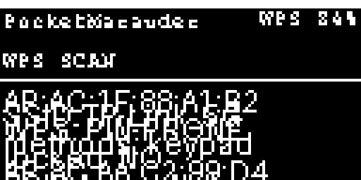
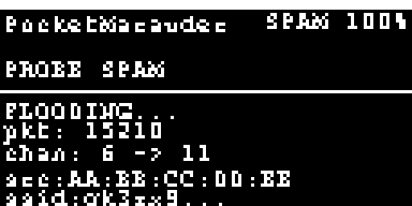
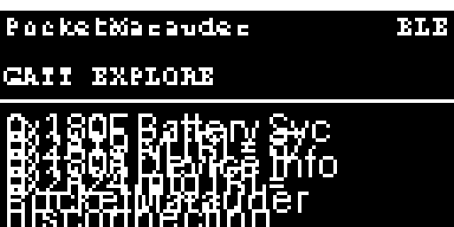
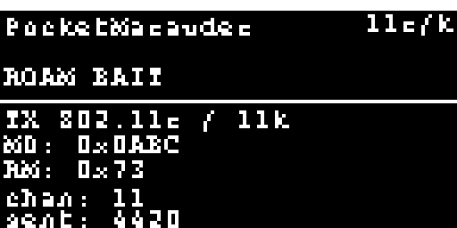

# PocketMarauder — Manual Pengguna

Manual ini menjelaskan cara menggunakan perangkat PocketMarauder dari awal: menyalakan, menavigasi menu, memakai semua fitur, sampai membaca output di serial monitor. Gambar-gambar di bawah adalah **simulasi tampilan OLED** (piksel asli perangkat adalah 128x64 mono; simulasi di-skalakan 4× agar terbaca).

---

## 1. Sekilas Perangkat

PocketMarauder adalah perangkat pentest saku berbasis ESP32 dengan:

- **OLED 128x64** monokrom — semua tampilan menu & hasil di sini.
- **4 tombol fisik** — navigasi & eksekusi.
- **WiFi 2.4 GHz** (ch 1-14) + **Bluetooth LE** (BLE 4.2/5.0).
- **Baterai LiPo** terintegrasi + **LED hijau** indikator aktivitas.

> **Gambar hardware**: [`images/hardware-placeholder.png`](images/hardware-placeholder.png)
> (masih placeholder — foto/diagram perangkat asli menyusul di folder yang sama; manual ini akan menunjuk ke file `hardware.png` begitu tersedia.)

## 2. Tombol & Navigasi

Semua tombol active-low, dengan pull-up.

| Tombol | Posisi GPIO | Fungsi |
|---|---|---|
| **A** (atas) | IO35 | Naik satu item menu |
| **B** (kiri) | IO32 | **Back** — kembali ke menu sebelumnya; menghentikan scan/attack yang berjalan |
| **C** (tengah) | IO33 | **Select/Enter** — membuka item yang disorot / memulai scan |
| **D** (bawah) | IO25 | Turun satu item menu |

Aturan navigasi:

1. Item yang disorot di-highlight (baris putih terbalik, awalan `>`).
2. Menu ber-scroll jika item melebihi satu layar.
3. Tekan **B** kapan pun untuk berhenti & kembali.
4. Setelah scan/attack selesai (ditutup tombol B), perangkat kembali ke menu utama.

## 3. Daya, Baterai, LED

### Menyalakan / Mematikan
Perangkat menyala saat diberi daya (baterai terpasang + saklar on, atau via USB charger TP4056). Tidak ada tombol power terpisah — matikan dengan memutus daya/saklar.

### Membaca Persentase Baterai
Status bar di baris paling atas OLED selalu menampilkan persentase baterai di sisi kanan (contoh: `84%`):

```
PocketMarauder                    84%
──────────────────────────────────
```

- Persentase dihitung dari tegangan baterai via divider (IO34), di-refresh tiap 3 detik.
- **Hijau** (dalam serial log) / tampilan normal: > 20%. Di bawah 20% persentase akan terlihat merah di log serial dan sebaiknya segera diisi ulang.
- Mengisi ulang: colokkan ke pengisi LiPo (port TP4056) — perangkat boleh tetap menyala.

### LED Hijau (IO19)
- **Menyala** = perangkat sedang melakukan WiFi scan/attack.
- **Padam** = idle di menu.
LED berguna untuk tahu secara sekilas (tanpa melihat layar) apakah ada operasi berjalan.

## 4. Urutan Boot

1. **Splash** — logo + "PocketMarauder" + versi, ~1 detik.
2. Inisialisasi OLED, WiFi radio, BLE.
3. Menu utama muncul; status bar mulai menampilkan persentase baterai.


## 5. Struktur Menu

```
Main Menu
├── Recon            → (aplikasi umum)
├── WiFi
│   ├── Sniffers     → Probe / Beacon / Deauth / EAPOL / Packet Monitor /
│   │                  Channel Analyzer / SA Commit / ★ WPS Scan
│   ├── Scanners     → Channel Analyzer & Summary, Fox Hunt, MAC Monitor
│   ├── Attacks      → Beacon List / Beacon Spam / Evil Portal / Deauth /
│   │                  ★ Probe Spam / ★ Roam Bait / Karma / Bad Msg / dst.
│   └── General Apps → Evil Portal, dll.
├── Bluetooth
│   ├── Sniffers     → Bluetooth Sniff, FindMy, CC Skimmers, Fox Hunt
│   └── Attacks      → Sour Apple, Apple Juice, Swiftpair Spam, BLE Spam,
│                      Spoof Airtag, ★ GATT Explore
├── Device           → info perangkat (versi, MAC, memory, baterai)
└── Reboot           → restart perangkat
```

`★` = fitur tambahan khusus PocketMarauder.

### 5.1 Main Menu


Sorot `WiFi` (tombol A/D), tekan **C**.

### 5.2 Menu WiFi


### 5.3 Submenu WiFi → Sniffers


### 5.4 Submenu WiFi → Attacks


### 5.5 Submenu BT → Attacks


## 6. Fitur Bawaan (ringkasan)

Fitur-fitur berikut berasal dari firmware ESP32Marauder upstream dan bekerja standar. Berikut ringkasan singkat; untuk detail penuh, konsultasikan dokumentasi upstream.

### 6.1 WiFi Sniffers
| Item | Yang dilakukan |
|---|---|
| **Probe Sniff** | Menangkap probe request dari client WiFi (SSID yang dicari client) |
| **Beacon Sniff** | Menangkap beacon frame — daftar AP di sekitar (SSID, MAC, channel, RSSI, encryption) |
| **Deauth Sniff** | Menangkap deauthentication frame |
| **EAPOL** | Menangkap frame autentikasi WPA handshake |
| **Packet Monitor** | Visualisasi throughput/frame rate secara real-time |
| **Channel Analyzer** | Grafik okupansi per channel |
| **SAE Commit** | Menangkap WPA3 SAE commit |

Hasil muncul di layar (baris-baris AP) dan di serial monitor (lebih lengkap).

### 6.2 WiFi Scanners & Attacks (bawaan)
- **Channel Summary / Analyzer** — okupansi channel 1-14.
- **Fox Hunt** — lacu AP/STA spesifik.
- **MAC Monitor** — deteksi perangkat yang "mengikuti" (mac monitor).
- **Beacon List / Beacon Spam** — broadcast beacon SSID dari list.
- **Evil Portal** — captive portal + portal phishing framework.
- **Deauth** — kirim deauth (broadcast atau targeted).
- **Karma** — probe-based SSID replay.
- **Bad Msg / Assoc Sleep / SAE Commit Flood / Channel Switch / Quiet Time** — varian attack lain.

### 6.3 Bluetooth
- **Bluetooth Sniff** — scan BLE umum (nama, MAC, RSSI) → juga mengisi daftar device yang dipakai fitur GATT Explore (lihat §7.3).
- **FindMy Sniff/Monitor** — deteksi AirTag & tracker FindMy.
- **CC Skimmers** — deteksi skimmer kartu kredit berbasis BLE (NFC/CC).
- **Sour Apple / Apple Juice** — Apple BLE spam.
- **Swiftpair Spam / Samsung / Google / Flipper BLE Spam / BLE Spam All** — flood BLE advertisement.
- **Spoof Airtag** — simulasi AirTag.

## 7. Fitur Tambahan PocketMarauder (Detail)

Keempat fitur di bawah adalah penambahaan di firmware ini. Output detail keempatnya **terutama tampil di serial monitor** — layar OLED menampilkan status berjalan; hasil lengkap (SSID/MAC/UUID/nilai) dibaca dari serial (lihat §9).

### 7.1 WPS Scan (pasif)

**Lokasi menu:** `WiFi → Sniffers → WPS Scan`

**Apa yang dilakukan:** Mode *pasif* — tidak mengirim satu pun frame. Perangkat menangkap beacon + probe-response dari AP di sekitar, lalu memeriksa IE (Information Element) WPS di tiap frame:

1. Cari vendor IE WPS (OUI `00:50:F2`, type `0x04`).
2. Di dalamnya baca **Config Methods** (atribut `0x1008`) dan **AP Setup Locked** (atribut `0x1057`).

**Klasifikasi hasil per AP:**
| Flag | Arti |
|---|---|
| **PIN-PRONE** | WPS aktif dan method **PIN/keypad** diiklankan → AP rentan terhadap WPS PIN brute-force (offline attack dengan captured EAPOL) |
| **LOCKED** | AP Setup Locked = 1 → PIN WPS dikunci (gagal berulang) — tidak bisa di-PIN lagi sampai direset |
| **WPS** | AP mengiklankan WPS dengan method lain (display/PBC) — dicatat, bukan target PIN |

AP yang tidak punya IE WPS sama sekali tidak ditampilkan.

**Cara pakai:**
1. `WiFi → Sniffers → WPS Scan`, tekan **C**.
2. Perangkat men-scan promiscuous di semua channel (hop channel otomatis).
3. AP yang terdeteksi tampil di layar & serial, sekali per MAC (deduplikasi).
4. Tekan **B** untuk berhenti.

**Contoh output serial:**
```
WPS: AP AC:1F:88:A1:B2  SSID TP-Link_5G  CH 6
     WPS PIN-PRONE  (methods: keypad 0x8)  locked: NO
WPS: AP 8C:AA:C2:99:D4  SSID HomeNet  CH 11
     WPS LOCKED  (methods: display 0x10)  locked: YES
```

**Catatan penting:** Ini *hanya pengamatan pasif* (setara memindai jaringan). Tidak ada injeksi WPS PIN — ESP32 tidak memiliki supplicant WPS untuk attack aktif. Untuk eksploitasi aktif pada AP yang `PIN-PRONE`, diperlukan tools di PC (mis. hcxdumptool/hcxpcapng + eapol2wps + airpwn) yang bekerja pada capture hasil scan ini.

**Simulasi layar saat berjalan:**


### 7.2 Probe Spam

**Lokasi menu:** `WiFi → Attacks → Probe Spam`

**Apa yang dilakukan:** Membangun & memflood **probe request** dengan SSID acak (panjang 1-32 karakter, dari alphabet a-z 0-9) dan source MAC acak, di setiap channel. Tiap tick (~interval main loop) dikirim **55 frame** per channel, lalu hop channel.

**Kegunaan (pentest):**
- Mengukur bagaimana AP/controller enterprise merespon volume probe request yang tidak wajar (rate-limiting, alarm IDS, perilaku fail-safe).
- Mengisi log client dengan probe SSID tidak dikenal untuk melatih deteksi anomaly.
- Uji ketahanan monitoring wireless (WIDS/WIPS).

**Cara pakai:**
1. `WiFi → Attacks → Probe Spam`, tekan **C**.
2. Layar menampilkan counter packet & channel saat ini; LED hijau menyala.
3. Tekan **B** untuk berhenti.

**Simulasi layar saat berjalan:**


### 7.3 GATT Explore (BLE)

**Lokasi menu:** `BT → Attacks → GATT Explore`

**Prasyarat:** Harus ada **daftar device BLE** dulu. Jalankan `BT → Sniffers → Bluetooth Sniff` (atau scan BLE lain) sampai ada device, baru masuk ke GATT Explore.

**Apa yang dilakukan:**
1. Menampilkan submenu berisi device BLE yang ter-scan (nama + RSSI).
2. Pilih satu device → perangkat **connect** sebagai BLE client (NimBLE).
3. **Enumerasi GATT**: daftar semua Service → setiap Characteristic dengan propertinya:
   - `[R]` = readable, `[W]` = writable, `[N]` = notify, `[I]` = indicate
   - Jika readable: **nilai saat ini di-read** dan dicetak (hex + string jika printable).
4. Setelah selesai, device diputuskan sambungannya otomatis.

**Kegunaan (pentest):** Memetakan permukaan attack GATT sebuah device BLE (mana yang bisa dibaca/ditulis/notified) — langkah awal untuk analisis security device IoT/BLE.

**Contoh output serial:**
```
GATT: connecting to AA:BB:CC:DD:EE:FF
GATT: connected
  Service 0x180F (Battery Service)
    Char 0x2A19 (Battery Level) [R] = 87
  Service 0x180A (Device Information)
    Char 0x2A24 (Manufacturer Name) [R] = PocketMarauder
    Char 0x2A25 (Model Number) [R] = PM-01
GATT: enumeration complete. Disconnecting.
```

**Catatan:** Device yang tidak mengizinkan connect (bonding hanya, atau whitelist) akan gagal — lihat pesan error di serial. Beberapa device memutus koneksi saat dibaca agresif.

**Simulasi layar saat berjalan:**


### 7.4 Roam Bait (Beacon 802.11r/11k)

**Lokasi menu:** `WiFi → Attacks → Roam Bait`

**Apa yang dilakukan:** Membroadcast beacon frame dengan SSID acak yang membawa dua Information Element khusus:

| IE | Tag | Isi | Fungsi |
|---|---|---|---|
| **802.11r** — Mobility Domain | `0x36` | MD Identifier `0x0ABC` + Individual C | Menandai beacon sebagai bagian dari "fast roam domain" (FT) |
| **802.11k** — RM Enabled Capabilities | `0x46` | `0x73` (bit: enabled + external APs report + beacon report) | Mengklaim dukungan Radio Measurement |

**Kegunaan (pentest):** Menguji apakah client enterprise (laptop/phone yang dikonfigurasi Fast Roam) **tertarik & mencoba pindah** ke AP palsu ini, atau apakah WIDS mendeteksi beacon 11r/11k yang tidak terdaftar di kontroler. Berguna untuk memvalidasi konfigurasi roaming security (FT SAIC validation, PMK caching).

**Cara pakai:**
1. `WiFi → Attacks → Roam Bait`, tekan **C**.
2. Beacon dikirim per tick di channel saat itu (channel mengikuti hop).
3. Tekan **B** untuk berhenti.

**Simulasi layar saat berjalan:**


## 8. Status Bar

Baris teratas OLED di semua menu:

```
+------------------------------------------+
| PocketMarauder            [icons]  84%   |
+------------------------------------------+
```

- **Kiri** — nama perangkat / nama menu aktif.
- **Kanan** — persentase baterai (refresh 3 detik).
- Di beberapa mode ada counter (pkt/kanal) menggantikan ikon.

## 9. Membaca Output di Serial Monitor

Layar 128x64 terbatas; **detail hasil (terutama 4 fitur tambahan) keluar lewat serial USB (115200 baud)**.

1. Sambungkan perangkat ke PC via kabel USB (port serial).
2. Buka serial monitor (PlatformIO: `python -m platformio run -e pocket_marauder -t monitor`, atau PuTTY/Arduino IDE/`screen` di baud 115200).
3. Jalankan fitur apa pun — output detail (MAC, SSID, UUID, hex value) tercetak real-time.

> **Catatan:** bila port serial dipakai untuk **flash**, monitor tidak bisa buka bersamaan. Pasang dulu, buka monitor, baru gunakan.

## 10. Tips & Troubleshooting

| Gejala | Penyebab / Solusi |
|---|---|
| OLED hitam total | Cek I2C (SDA=21, SCL=22); coba reboot; address default 0x3C |
| Persentase baterai loncat-loncat | Normal — dibaca ADC tiap 3 detik; cek koneksi battery |
| LED tidak menyala saat scan | LED active-low; pastikan tidak ada short di IO19 |
| GATT Explore tidak muncul / kosong | Belum ada device BLE — jalankan dulu BT Sniff |
| GATT connect gagal | Device tidak mengizinkan client, atau di luar jangkauan |
| WPS Scan tidak menemukan AP | Memang tidak ada AP WPS di sekitar (sebagian besar AP modern sudah mematikan WPS) |
| Scan WiFi tidak banyak hasil | Pastikan antena U.FL tersambung & perangkat di area terbuka |
| Build gagal di `pio run` | Pastikan `python -m platformio` versi terbaru & sudah `pio` platform terunduh |

## 11. FAQ

**Q: Apakah perangkat bisa dipakai offline (tanpa PC)?**
A: Ya. Semua fitur berjalan standalone; hasil tampil di OLED + tersimpan di memori. Output detail & capture PC butuh kabel serial.

**Q: Baterai tahan berapa lama?**
A: Tergantung mode. Scan WiFi kontinu ≈ 2-3 jam; idle ≈ 12+ jam. Monitor persentase di status bar.

**Q: Apakah ada SD card untuk simpan capture?**
A: Tidak di board ini (desain tanpa slot SD). Capture tersimpan di RAM/flash sementara & serial.

**Q: Bagaimana cara update firmware?**
A: Flash ulang `firmware.bin` terbaru (build §README) via PlatformIO.

## 12. Disclaimer Hukum

Perangkat ini disediakan **untuk pengujian keamanan yang sah**: laboratorium milik sendiri, jaringan yang kamu miliki, atau dengan **izin tertulis eksplisit** dari pemilik jaringan.

Mengoperasikan attack (deauth, spam, beacon palsu, dsb.) terhadap jaringan yang tidak kamu miliki **tanpa izin** adalah pelanggaran hukum (mis. UU ITE di Indonesia, CFAA di AS, Computer Misuse Act di UK). Pengguna sepenuhnya bertanggung jawab atas penggunaan perangkat ini.

---
*Versi manual: 1.0 — selaras dengan firmware v1.17.0 + fitur tambahan PocketMarauder (commit `c1cb904`).*
